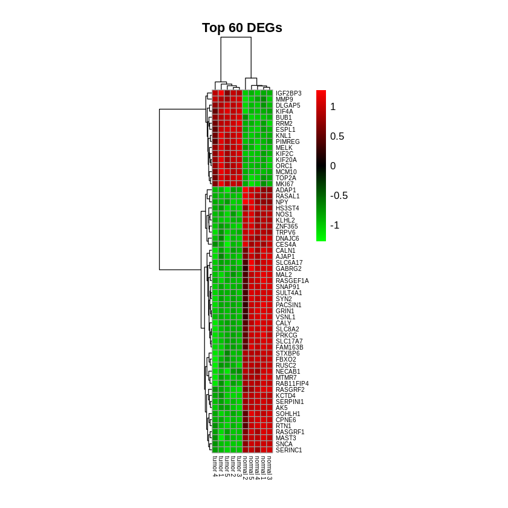
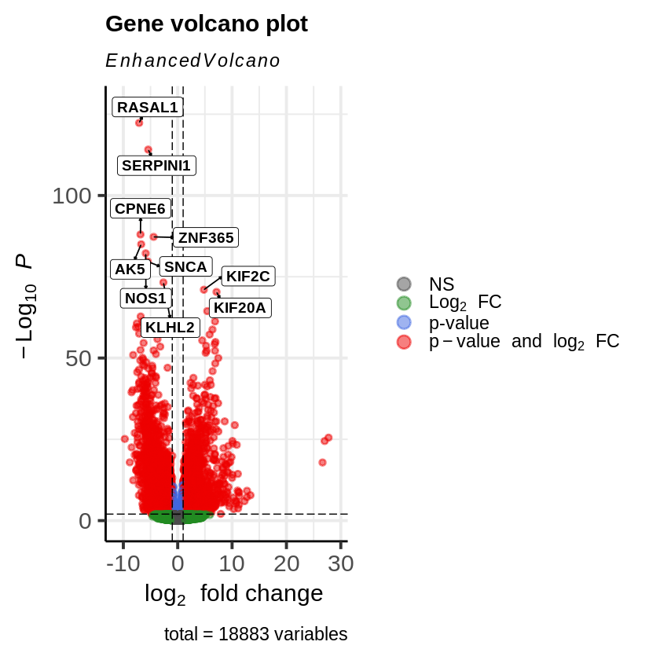

# TCGA Glioblastoma RNA-seq Analysis Project 
### Transcriptome profiling, DEG analysis, and visualization

## Introduction
This project explores RNA-seq data from TCGA Glioblastoma (GBM). I downloaded, filtered, and analyzed normal and tumor samples to identify differentially expressed genes (DEGs).  
In this project, both R and Python were used: R for DEG analysis and most visualizations (PCA, Volcano, Heatmap, and Bar plots), and Python for generating the t-SNE plot.

## Figures
- Heatmap of top 60 DEGs (R)  
- Volcano plot of DEGs (R, top 10 labeled)  
- Bar plot showing distribution of RNA types across samples (R)  
- PCA plot showing separation of normal vs tumor samples (R)  
- t-SNE plot for visual clustering (Python)

## User Instructions
To reproduce the analysis:

1. Open the scripts in RStudio or VSCode.
2. Adjust file paths if needed.
3. Run the R scripts in R_scripts/ step-by-step to reproduce the DEG analysis and the resulting visualizations.
4. Run Python scripts in Python_scripts/ for t-SNE visualization.

## Developer Instructions
- Raw and processed data are in the Data-1/ and Data-2/ folders.
- Plots are in the Results/ folder.
- Code includes comments explaining each step for reproducibility.

R packages used: TCGABiolinks, SummarizedExperiment, Readxl, ggplot2, DESeq2, pheatmap, RColorBrewer, EnhancedVolcano  
Python packages used: pandas, matplotlib, scikit-learn.

## Expectations for Contributors
- Use this project as a reference for learning or personal exploration.
- Ensure proper citation if any part of this project is used in academic work.

## Known Issues
- Small sample size (5 normal + 5 tumor) limits statistical significance.
- Some plots are illustrative rather than conclusive.
- File paths may need adjustment depending on local setup.